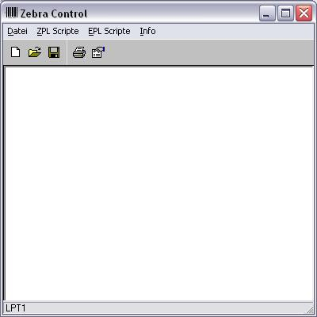



## Zebra Control 1\.3\.1

### Description

You can control any Zebra or Eltron Printer

Change language between english and german
 
### More Info
 

             |
---                |---
**Submitted On**   |2005-12-06 16:03:18
**By**             |[Hermann Linemayr](https://github.com/Planet-Source-Code/PSCIndex/blob/master/ByAuthor/hermann-linemayr.md)
**Level**          |Intermediate
**User Rating**    |4.3 (13 globes from 3 users)
**Compatibility**  |VB 5\.0, VB 6\.0
**Category**       |[Complete Applications](https://github.com/Planet-Source-Code/PSCIndex/blob/master/ByCategory/complete-applications__1-27.md)
**World**          |[Visual Basic](https://github.com/Planet-Source-Code/PSCIndex/blob/master/ByWorld/visual-basic.md)
**Archive File**   |[Zebra\_Cont1966631202006\.zip](https://github.com/Planet-Source-Code/hermann-linemayr-zebra-control-1-3-1__1-62161/archive/master.zip)

